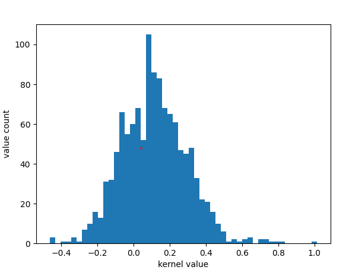
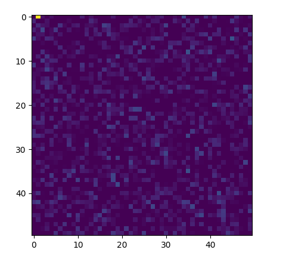

## Model: test_more_local_non_normalized_max_distance800
### Ecoder Fusion Module

##### Kernels:
The figure bellow shows the distribution of kernel weights 
for the  1x1 convolutions of final RGBD feature aggregation block.
There seems to be a weak general bias 
for activation within this model. Activatoins in the eincoder block are lowered. 
The reuslt of this Fusion block is the depth output more (pixel wise attention without
addition for depth and pixel wise attention with adition for RGB). 
So it seems like the kernel has no significant bias here.  
But since these features re added to the RGB path as well, I can not be sure

average_value, -0.014393030382164987

median_value, -0.01303571229800582

variance, 0.006144786366134184

standart derivation, 0.0783886877434122

#### Bias 

But there is a clear bias in whe weghts bias.

The bellow image shows the distribution of biases (the additions for the features). 
The biases in question are for 1x1 convolutions (and therefore pixel wise, not feature map based).

There is a noticable bias for lowering the activation of the resulting image. 
Depth information is more impacted by this effect.
average oif bias means, that weak activation are effectovely removed (set bellow relu threshhold)

average_value, -0.08208467602838881

median_value, -0.05417087860405445

variance, 0.01856466478843769

standart derivation, 0.13625221021487208

This bias may also occur, because the depth information is used twice (once in the 
depth and once in the RGb channel) and the model attempts to tune down the over reliance on 
depth information

### fully_local vs semi_local (Resplacement Excitation) 

Idea: To show impoirtance of activation derivation create a small network with 
random weights that conforms to the distrobution of the data below. Then use white 
images (or something smilar, where the effect is nicely visible) and use them as input.
The color of the resulting images should preent the importance of the weights nicely.
//this process may be somewhat faulty, check to make sure it actually does what I think it does

These distributions express how often usefull feature maps are found by the 
attention mechanism in the fully or semi local feature map. Higher weights mean 
that the respective feature map.

semi local mean that diöated convolutions are utilized (the receptive field 
is increased without increazing the number of non zero values in a filter)
bias refers to the value that is added to the result of a dense layer 
kernel is the multiplier for a activation value 

bias punishes/rewards weak activations more then strong activations (flat reduction)
kernel punishes/rewards strong activations more then weak activations (percentage reduction)

negative values punish propably more then positive reward (see example calculations for impact in respective category)
#### Bias_semi_local
There is a clear tendency for the weights of the semi local weights to bve positive,
indicating that the model favours semi local featuers (because they tend to contribute to 
a correct outcome).
Activations in layers where sigmoid and relu. bias for relu may push activation above 0, 
so the value can contribute to next feature. Bias for sigmoid simply ads a "flat activation"
(1.11^11=3.5) //i am uncertain if it should be ^11 or ^22 for to represent the actual impact

average_value, 0.1144806716307564 

median_value, 0.1089431568980217

variance, 0.03275817631914463

standart derivation, 0.18099219960855945

#### Bias_fully_local
There is a clear tendency to reduce the activation of fully local features (propably
because they generally contribute less to correct outcomes)

average_value, -0.09053714954513539

median_value, -0.07775506749749184

variance, 0.019669598231962418

standart derivation, 0.14024834484571438

((1-0.09)^11 = 0.35) it just fucking slashes the activation

#### kernels_semi_local

Kernels show simmilar trend to bias values. Semi local features are generally promoted
(average is 0.07, not massive but makes a difference after the total of 22 layers
(1.07^11= 2.1))

average_value, 0.07021801239892284

median_value, 0.06356098502874374

variance, 0.06413566772824474

standart derivation, 0.2532502077555806

#### kernels_fully_local
Same trend that could bee seen in bias, weaker here. Median value for weights, is negative
but barely enought to make a difference ((1-0.01)^22 = 0.89)

average_value, -0.007437414093307164

median_value, -0.010801228694617748

variance, 0.022209942813671706

standart derivation, 0.1490300064204243

## Impact of average and median

The images bellow visualize the impact different atentional weight distributions have on 
the resulting activations. To do so a small Neural network was simulated, where a 
number of dense layers is applied (simple fully connected Network and on CNN). Initialization 
of weights was  "tf.keras.initializers.RandomNormal" (a bell courve with mean of 0)
for both kernel and bias.

THis network was executed once without attentional mechanism to gain a reference value.
This network was then expanded to include a attentional mechanism, with random values 
with a given distribution (the distribution of the semi_local values was used)

Note: This experimental setup varries from the real apllication. Here one attentional value is 
applied to a pixel rather then to an entire image. Its purpose is only to show the 
generall impact of attention to values in a NN 

The image bellow shows the Dense NN without attentional activation 
average value is 294. (the bright yellow pixel in corner was set manually to
ensure the colors between images represent the same values). Max value (yellow) is 4000.

The image below is the Dense NN with applied attention (
    mean_mult = 1.071
    std_derivation_mult = 0.253
    mean_bias = 1.114
    std_derivation_bias = 0.181).

average value is 943, image was capped at value 4000 (yellow). 
This activation is significant higher then the activation without attention

!!! The actuall impact will not be quite as drastic. This is an idealized 
test to show the potential effect of this weight distribution

## Other models:
For other (worse performing models), ther are sometimes some biases, but none are this noticeable 
The atentional weights are generally very close ot center. Kernels and corresponding biases 
tend tend not to have the same sign. (generally kernel positive, bias negative).

The best model actually used the Fusion module, while the others didnt. The model with the fusion module is 
also the model with the strongest shift in attentional weights (in resplacement module)

